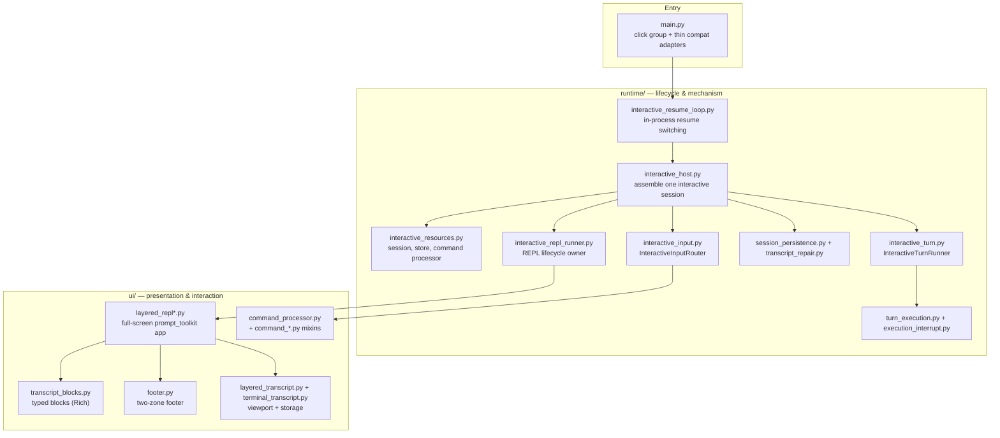
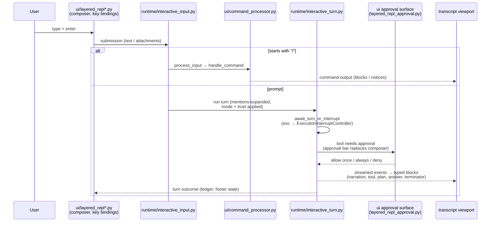
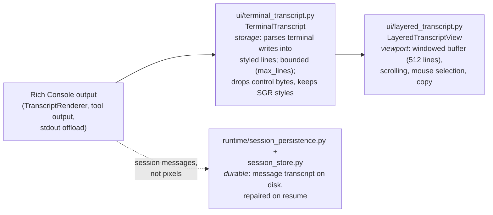

# Interactive TUI architecture

How the full-screen interactive shell is put together: the `runtime/` vs `ui/`
split, the input → command → turn → approval → render flow, and the
storage-vs-viewport separation for the transcript.

Governing decisions:

- [ADR-0005 — Interaction Modes and Trust Postures](../decisions/ADR-0005-interaction-modes-and-trust-postures.md)
  (modes, approvals, deny-and-continue, steering, evidence, ledger).
- [ADR-0006 — Full-Screen Pinned Interactive Shell](../decisions/ADR-0006-full-screen-pinned-interactive-shell.md)
  (why a layered prompt_toolkit application replaced the line-based REPL).

Presentation (colors, glyphs, labels, layout, hints) is specified by
[tui-v3-cohesive.md](tui-v3-cohesive.md); theme tokens live in
`amplifier_app_cli/ui/layered_repl_style.py`. The old monolithic `main.py` is
mapped to these modules in
[MIGRATION-main-decomposition.md](../MIGRATION-main-decomposition.md).

## The `runtime/` vs `ui/` split

- **`amplifier_app_cli/runtime/`** owns session *lifecycle and mechanism*:
  assembling a session, routing submissions, executing turns, interrupt
  handling, persistence, transcript repair, resume switching. It makes no
  rendering decisions; everything it needs from the presentation layer is
  injected through typed request/dependency dataclasses (patchable seams
  pinned by `tests/test_main_entrypoint_boundary.py` and
  `tests/test_runtime_config_boundaries.py`).
- **`amplifier_app_cli/ui/`** owns *presentation and interaction*: the layered
  prompt_toolkit application and its surfaces (composer, footer, approval bar,
  palette, agent lanes, notices), typed transcript blocks rendered with Rich,
  slash-command processing, and mode/trust display.

Single-shot (`amplifier run "prompt"`) bypasses the TUI entirely:
`main.py execute_single` → `runtime/single_execution.py`.

## Input → command → turn → approval → render

One composer submission flows through a single dispatch path
(`runtime/interactive_input.py InteractiveInputRouter`):

Key properties:

- **Mid-turn input** is routed, not blocked: enter steers the running turn,
  queued messages run at turn end (spec section 5, ADR-0005 steering).
- **Approvals** suspend the composer, not the event loop; denial follows
  deny-and-continue (ADR-0005) and can defer to the needs-you queue.
- **Interrupts** (esc) go through `ExecutionInterruptController` so the
  session cancels cooperatively and the turn terminator still renders.
- **Rendering** is always typed: runtime code emits blocks/events; only
  `ui/transcript_blocks.py TranscriptRenderer` decides what they look like
  (goldens: `tests/test_transcript_golden_widths.py`).

## Transcript: storage vs viewport

The transcript is stored and displayed by different objects with different
lifetimes:

- **Storage** (`TerminalTranscript`) captures everything written to the
  terminal — including ANSI-styled output from Rich — as compact immutable
  lines, so scrollback survives resize and re-render without re-executing
  anything.
- **Viewport** (`LayeredTranscriptView`) is a prompt_toolkit `BufferControl`
  window over that storage: it materializes only the visible window
  (~512 lines), and owns scrolling, selection, and copy behavior.
- **Durable transcript** is separate again: `SessionStore` persists the
  *conversation* (messages, metadata), not the rendered pixels;
  `runtime/transcript_repair.py` reconciles it on resume.

This separation is why the TUI can re-theme, resize, and window scrollback
cheaply, and why golden tests hash the *renderer output* rather than the
screen: presentation is a pure function of typed blocks plus theme tokens.

## Testing map

| Concern | Suite |
|---|---|
| Typed block rendering (exact) | `tests/test_transcript_golden_widths.py` |
| Footer rendering (exact) | `tests/test_footer_golden_widths.py` |
| Storage parser (ANSI, bounds) | `tests/test_terminal_transcript.py` |
| Layered REPL surfaces / layout | `tests/test_layered_repl*.py` |
| Input routing / turns / interrupts | `tests/test_interactive_*.py`, `tests/test_turn_execution.py` |
| Architectural boundaries | `tests/test_private_api_boundaries.py` and the `*_boundary*.py` suites |
| Real PTY behavior | `tests/test_tui_pty.py` (`uv run pytest -m integration`) |

Golden regeneration: `uv run python tests/regen_goldens.py --write`
(see `AGENTS.md`).
